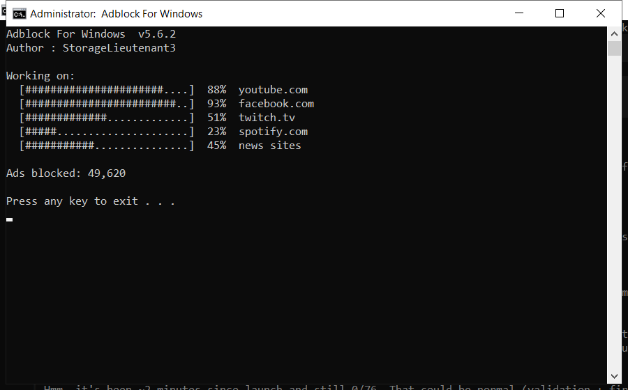

# Adblock For Windows: Free Download and Guide (2026)

  

  

**Adblock for windows** is a maintenance tool for Windows written to be simple: one window, plain settings, no confusing options. Download it, run a scan, done. **Free to use, no strings attached.**

## Overview

Adblock for windows is a maintenance tool for Windows. It scans your system for problems such as leftover files and invalid registry entries, then removes or repairs them. Everything happens locally on your PC - nothing is uploaded anywhere.

| **Term** | **Meaning** |
| --- | --- |
| **Registry** | The Windows database of settings |
| **Junk files** | Temporary files left behind by programs |
| **Startup items** | Programs that launch with Windows |
| **Optimize** | Make the system run faster |

## The Problem

- **Disk almost full** - updates need space you do not have
- **Programs fight for RAM** - everything feels sluggish
- **Leftover drivers** - old devices still load software
- **Unchecked temp files** - they grow back every day
- **No clear report** - you cannot see what is using space

## How It Fixes It

| **Problem** | **Solution** |
| --- | --- |
| **Low disk space** | Free up space safely |
| **Freezes and errors** | Repair system entries |
| **Manual cleaning** | One-click maintenance |
| **Fake tools** | Tested build on this page |
| **Hard to use** | Simple, plain settings |

## Install

1. **Download** and unzip the package
2. **Right-click** the program and choose Run as administrator
3. **Choose a scan type** (quick or deep)
4. **Wait** for the report
5. **Select** the items to remove and confirm

  

> **Note:** if nothing happens when you click, run the file as administrator. Windows sometimes blocks new programs until you allow them.

## Features

| **Feature** | **Details** |
| --- | --- |
| **Supported systems** | Windows 10 and 11 |
| **Scheduling** | Optional automatic scans |
| **Undo** | Restore point created first |
| **Interface** | Simple, plain English |
| **Safety** | Scanned and tested build |
| **Version** | Current 2026 release |

## Requirements

| **Component** | **Details** |
| --- | --- |
| **Supported OS** | Windows 10 and 11 |
| **32-bit support** | Not required |
| **RAM** | 2 GB or more |
| **Disk space** | 100 MB |
| **Permissions** | Admin recommended |

## What's Included

| **Component** | **Details** |
| --- | --- |
| **Main tool** | Latest 2026 build |
| **Guide** | Step-by-step setup |
| **FAQ** | Common questions |
| **Support** | Via the issues section |

## Compared With Alternatives

| **Feature** | **Typical cleaners** | **adblock for windows** |
| --- | --- | --- |
| **Cost** | Subscription | Free |
| **Backup** | Sometimes | Always |
| **Clarity** | Confusing options | Plain settings |
| **Extras** | Unwanted add-ons | None |

## Tips

- Run the first scan with admin rights for full results
- Let it finish - do not close the window mid-scan
- Check the report before removing anything large
- Schedule a weekly scan if you use the PC daily
- Exclude the tool's own folder from antivirus

## Troubleshooting

| **Issue** | **Fix** |
| --- | --- |
| **Windows warns about the file** | Click More info, then Run anyway |
| **Slow first launch** | Normal - it indexes on first run |
| **Scan finds nothing** | Good - your PC is already clean |
| **Settings do not save** | Run as admin once so it can write config |

## FAQ

**What exactly does it clean?**

Temporary files, caches, logs, broken shortcuts and unused leftovers. You see a list before anything is removed.

**How long does a scan take?**

One to three minutes for a quick scan; a deep scan takes longer.

**Is it safe for a work PC?**

Yes. It makes a restore point first and never touches your documents.

**Does it send data anywhere?**

No. There is no telemetry and no cloud upload - it is fully local.

## Summary

**Adblock for windows** restores the speed your PC had when it was new. It clears the accumulated junk and broken settings that build up over time, and it does so safely.

- Quick or deep scans
- Automatic backup
- Scheduled weekly cleaning
- No cost, no registration

**Download the 2026 version now.**

---

*tranquil-mesa-790 · Updated 2026-10-08 · Shared under the MIT License*
